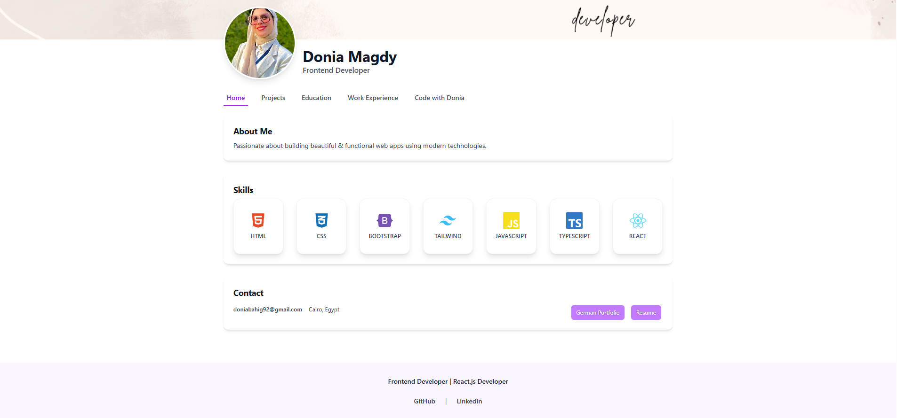
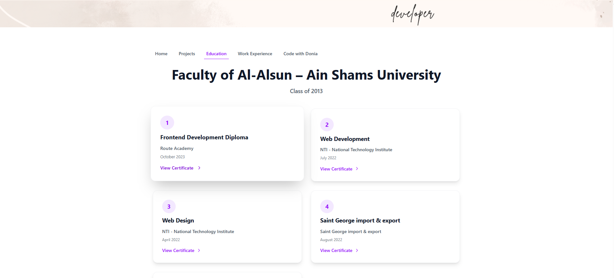
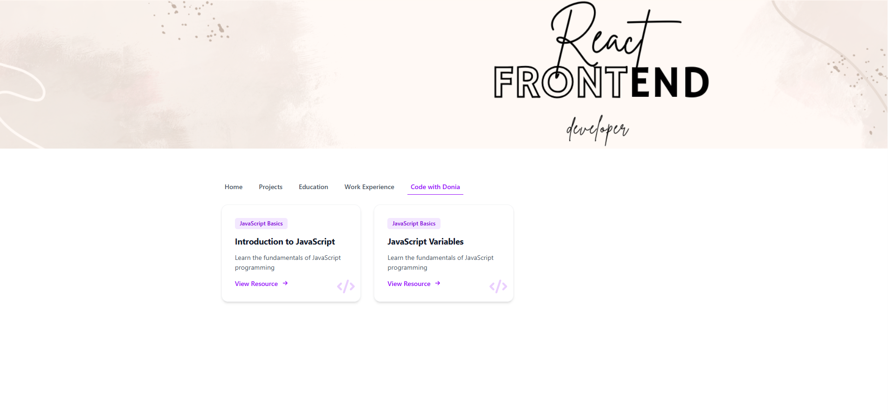
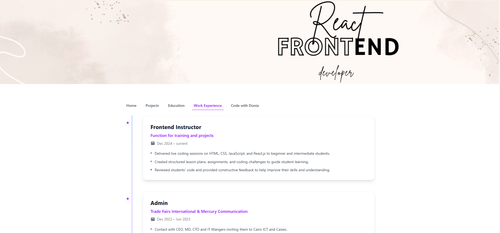

# My Portfolio

## 1.Description 
- A modern and responsive portfolio website built with React.js to showcase my frontend development projects, skills, and experience. 

## 2.Screenshots
#### Home 


#### Education 


#### Code with Donia 


#### Work Experience


## 3.Live Demo
[Live Demo](https://portfolio-tau-five-ufwp7kyoh5.vercel.app/)

## 4.Features
- Responsive design for all devices
- Smooth navigation and user-friendly UI
- Projects showcase with live demos and source code

## 5.Technologies
- React
- Tailwind/css

## 6.Project Structure
```bash

src/
│ 
│   App.css
│   App.jsx
│   index.css
│   main.jsx
│   
├───assets/
│
├───components
│   │   About.jsx
│   │   Contact.jsx
│   │   ProjectCard.jsx
│   │   Skills.jsx
│   │   Tabs.jsx
│   │
│   └───layout
│           CoverImage.jsx
│           Footer.jsx
│           Layout.jsx
│
└───pages
        CodeWithDonia.jsx
        Education.jsx
        Hero.jsx
        Home.jsx
        Projects.jsx
        Work.jsx
```

## 7.Contact

- Email: doniabahig92@gmail.com
- LinkedIn: https://www.linkedin.com/in/donia-magdy-b6480612b/

#### This project is part of my journey as a Frontend Developer💖
